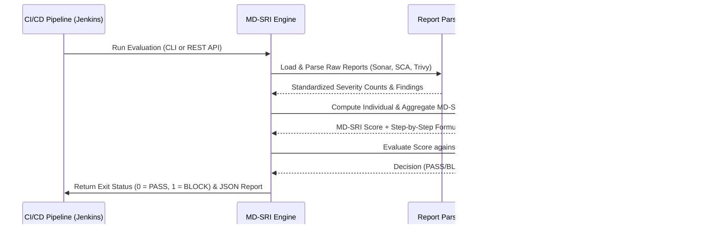

# MD-SRI Engine (Multi-Dimensional Security Risk Index)

[](https://golang.org)
[](https://gofiber.io)
[]()

The **MD-SRI (Multi-Dimensional Security Risk Index) Engine** is a research-oriented DevSecOps security assessment framework designed for IEEE cybersecurity papers. It solves the problem of security report aggregation by parsing outputs from multiple independent scanning tools (SAST, SCA, and Container scan), projecting the vulnerabilities into a unified risk scale, applying customized weights, evaluating the total score against environment-specific risk thresholds, and enforcing hard veto rules to automatically output a deployment decision (`PASS` or `BLOCK`).

---

## 🏛️ System Architecture

The following Mermaid sequence diagram depicts the flow of reports and the evaluation pipeline:



---

## ⚙️ How it Works

### 1. Severity Score Calculation
For each individual tool (SAST, SCA, Container), the raw tool score is computed based on severity weights defined in the YAML configuration:

$$\text{ToolScore} = (\text{Critical} \times W_{crit}) + (\text{High} \times W_{high}) + (\text{Medium} \times W_{med}) + (\text{Low} \times W_{low})$$

*Default Config Weights:*
- **Critical**: 4.0
- **High**: 2.0
- **Medium**: 1.0
- **Low**: 0.25

### 2. Multi-Dimensional Aggregate Index
The overall **MD-SRI** score is calculated using category weights corresponding to the depth of the scan dimensions:

$$\text{MD-SRI} = (\text{SASTScore} \times W_{sast}) + (\text{SCAScore} \times W_{sca}) + (\text{ContainerScore} \times W_{container})$$

*Default Category Weights:*
- **SAST (SonarQube)**: 30% ($0.30$)
- **SCA (OWASP Dependency Check)**: 30% ($0.30$)
- **Container (Trivy)**: 40% ($0.40$)

### 3. Policy Verdict
The calculated MD-SRI is compared against environment-specific maximum allowable thresholds:
- **Development**: 20.0
- **Testing**: 15.0
- **Staging**: 12.0
- **Production**: 8.0

If the score exceeds the threshold, or if a **hard veto rule** is violated (e.g., any Critical vulnerability exists while `veto_on_critical` is active), the deployment is **BLOCKED**. Otherwise, it **PASSES**.

---

## 🛠️ Project Structure

```
mdsri-engine/
├── cmd/
│   └── main.go              # App CLI / Server Entrypoint
├── configs/
│   └── config.yaml          # Severity, Category weights and policy configs
├── internal/
│   ├── calculator/          # MD-SRI score calculation logic
│   ├── models/              # Unified domain representations
│   ├── parser/              # JSON parsers (Sonar, Dep-Check, Trivy)
│   ├── policy/              # Environment thresholds & veto enforcements
│   ├── server/              # Fiber REST API server
│   └── utils/               # Configuration loading utils
├── reports/                 # Raw scanner reports directory
├── templates/
│   └── dashboard.html       # Dynamic Bootstrap dashboard HTML
├── output/                  # Generated JSON execution reports
├── Dockerfile               # Production multi-stage build definition
└── docker-compose.yml       # Docker compose orchestration definition
```

---

## 🚀 Getting Started

### Prerequisites
- **Go 1.24+**
- **Docker** (optional)

### Installation
Clone the repository and download Go dependencies:
```bash
go mod tidy
```

---

## 💻 CLI Usage

The engine compiles into a single CLI tool with `server` and `evaluate` commands.

### Evaluate Local Scan Reports
Execute the tool evaluation against a target environment (e.g., `production`):
```bash
go run cmd/main.go evaluate \
  --env production \
  --sonar reports/sonar.json \
  --dependency reports/dependency.json \
  --trivy reports/trivy.json
```

**Jenkins Integration:**
The engine automatically exits with:
- `0` if decision is **PASS**
- `1` if decision is **BLOCK**
This allows CI pipelines to block deployment steps directly.

---

## 🌐 REST API & Dashboard

### Start Web Server
Launch the REST server on port `8080` (default):
```bash
go run cmd/main.go server --port 8080
```

### API Endpoint: Evaluator Webhook
* **Route:** `POST /evaluate`
* **Content-Type:** `application/json`
* **Request:**
  ```json
  {
    "project": "Demo application",
    "environment": "production",
    "sonar": "reports/sonar.json",
    "dependency": "reports/dependency.json",
    "trivy": "reports/trivy.json"
  }
  ```
* **Response:**
  ```json
  {
    "overall_score": 3.7,
    "decision": "PASS",
    "reason": "Overall MD-SRI score (3.70) is within production threshold (8.00)."
  }
  ```

### HTML Web Dashboard
Open the interactive, dark-themed metrics dashboard in your web browser:
```
http://localhost:8080/dashboard
```

It visualizes the overall risk metrics, category contributions, raw severity distributions, and shows a search/detail table of all vulnerabilities compiled across the tools.

---

## 🐳 Docker Deployment

Build and spin up the engine container locally using docker-compose:
```bash
docker-compose up --build -d
```
The application will start, serving the Web API and dashboard on `http://localhost:8080`.
Generated reports are synchronized back to the host machine in the `./output` directory.
